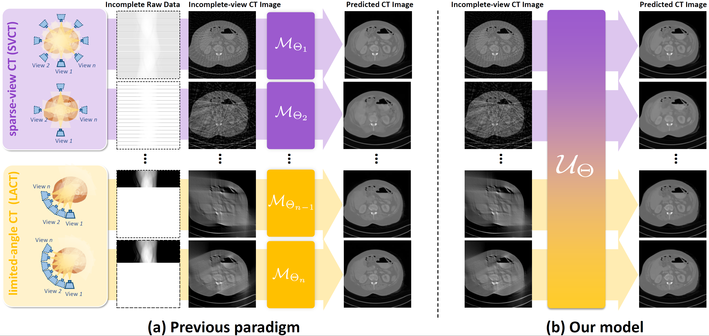

# Prompted Contextual Transformer for Incomplete-View CT Reconstruction
This repository contains the official implementation of the paper: "[Universal pre-training for generalizable incomplete-view CT reconstruction](https://www.sciencedirect.com/science/article/pii/S0031320326004796)" (previously: Prompted Contextual Transformer for Incomplete-View CT Reconstruction)

## TL;DR
We build a robust and transferable network (named ProCT) that can reconstruct degraded CT images from a vast range of incomplete-view CT settings within a single model in one pass, by leveraging multi-setting synergy for training.




## Abstract
> Incomplete-view computed tomography (CT), which includes both sparse-view and limited-angle CT, aims to reduce radiation exposure, shorten data acquisition time, and enable more flexible scanning protocols. However, due to the significantly reduced number of projection views, it introduces complex artifacts in the reconstructed CT images, ultimately compromising diagnostic accuracy. Existing CT reconstruction methods often address each incomplete-view CT setting in isolation, i.e. one-setting-one-model, and overlook the multi-setting synergistic benefits on each other, resulting in limited generalizability to new datasets and settings. In this paper, we introduce universal pre-training that exploits multi-setting data to enhance incomplete-view CT reconstruction. To effectively integrate complementary knowledge across CT settings during such pre-training, we propose a Prompted Contextual Transformer (ProCT), featuring two key techniques. First, we devise view-aware prompting to encode view distribution knowledge into ProCT for handling diverse settings within a single model. Second, we propose artifact-aware contextual learning to extract artifact pattern knowledge from in-context image pairs, facilitating the removal of complex, previously unseen artifacts. Extensive experimental results on two public clinical CT datasets demonstrate the proposed ProCT (i) outperforms state-of-the-art methods, including single-setting models, across various incomplete-view CT settings, (ii) exhibits strong generalizability to unseen datasets, and (iii) effectively adapts to out-of-domain settings with minimal tuning. Additionally, ProCT further improves performance when integrating sinogram data. Our work highlights the potential of universal pre-training in medical imaging and presents a new paradigm for robust and generalizable incomplete-view CT reconstruction. 


## Updates
- [x] training code.
- [x] demo.
- [x] pretrained model.
- [x] inference code.
- [x] architecture code.
- [x] 2023/12/13. Initial commit.


## Environment Preparation
We build our model based on torch-radon toolbox that provides highly-efficient and differentiable
tomography transformations. There are official [V1](https://github.com/matteo-ronchetti/torch-radon) repository 
and an unofficial but better-maintained [V2](https://github.com/carterbox/torch-radon) repository. V1 works for
older pytorch/CUDA (torch<= 1.7., CUDA<=11.3), while V2 supports newer versions. Below is a walkthrough for installing this toolbox.

### Installing Torch-Radon V1
- Step 1: build a new environment
```bash
conda create -n tr37 python==3.7
conda activate tr37
```
- Step 2: set up basic pytorch
```bash
conda install pytorch==1.7.1 torchvision==0.8.2 torchaudio==0.7.2 cudatoolkit=11.0 -c pytorch
```
or
```bash
pip install torch==1.7.1+cu110 torchvision==0.8.2+cu110 torchaudio==0.7.2 -f https://download.pytorch.org/whl/torch_stable.html
```


- Step 3: download toolbox code from https://github.com/matteo-ronchetti/torch-radon (master branch), `cd` to the directory, and run the setup:
```bash
python setup.py install
```


- Step 4: install other related packages
```bash
conda install -c astra-toolbox astra-toolbox
conda install matplotlib
pip install einops
pip install opencv-python
conda install pillow
conda install scikit-image
conda install scipy==1.6.0
conda install wandb
conda install tqdm
```


### Installing Torch-Radon V2
- Step 1: build a new environment
```bash
conda create -n tr39 python==3.9
conda activate tr39
```

- Step 2: set up basic pytorch
```bash
conda install pytorch==2.1.0 torchvision==0.16.0 torchaudio==2.1.0 pytorch-cuda=12.1 -c pytorch -c nvidia
```

- Step 3: download toolbox code from https://github.com/carterbox/torch-radon and run the setup.py with the following:
```bash
python setup.py install
```

- Step 4: install other related packages (same as above)


## Dataset Preparation
We use [DeepLesion](https://arxiv.org/abs/1710.01766) dataset and [AAPM Mayo 2016](https://aapm.onlinelibrary.wiley.com/doi/10.1002/mp.12345) dataset in our experiments.
DeepLesion dataset can be downloaded from [here](https://nihcc.app.box.com/v/DeepLesion), and the AAPM dataset can be downloaded from [Clinical Innovation Center](https://ctcicblog.mayo.edu/2016-low-dose-ct-grand-challenge/CT) (or the [box link](https://aapm.app.box.com/s/eaw4jddb53keg1bptavvvd1sf4x3pe9h/folder/144594475090)). 

When finishing downloading these two datasets, please arrange the DeepLesion dataset as follows:
```
__path/to/your/deeplesion/data
  |__000001_01_01
  |  |__103.png
  |  |__104.png
  |  |__...
  |
  |__000001_02_01
  |  |__008.png
  |  |__009.png
  |  |__...
  |
  |__...
```

and arrange the AAPM dataset as follows:
```
__path/to/your/aapm/data
  |__L067_FD_1_1.CT.0001.0001.2015.12.22.18.09.40.840353.358074219.npy
  |__L067_FD_1_1.CT.0001.0002.2015.12.22.18.09.40.840353.358074243.npy
  |__...

```

Finally, replace the global variables (`DEEPL_DIR` and `AAPM_DIR`) in `datasets/lowlevel_ct_dataset.py` with your own `path/to/your/deeplesion/data` and `path/to/your/aapm/data`!


## Demo
Once the environments and datasets are ready, you can check the basic forwarding process of ProCT in `./demo.ipynb`. The checkpoint file is provided in the [Releases](https://github.com/Masaaki-75/proct/releases) page.

**UPDATE**. Considering that some users have trouble installing torch-radon package, we update some pre-computed in-context pairs in `./samples` as well as a simpler demo in `./demo_easy.ipynb`, where the code does not require torch-radon at all!

## Training and Inference
Once the environments and datasets are ready, you can train/test ProCT using scripts in `train.sh` and `test.sh`.

## Acknowledgement
- Torch Radon ([V1](https://github.com/matteo-ronchetti/torch-radon) and [V2](https://github.com/carterbox/torch-radon))
- [DehazeFormer](https://github.com/IDKiro/DehazeFormer)
- [UniverSeg](https://github.com/JJGO/UniverSeg)
- [GloReDi](https://github.com/longzilicart/GloReDi)
- ...

Big thanks to their great work for insights and open-sourcing!

## Citation
If you find our work and code helpful, please kindly cite our paper :)

```
@article{MA2026113513,
title = {Universal pre-training for generalizable incomplete-view CT reconstruction},
journal = {Pattern Recognition},
volume = {178},
pages = {113513},
year = {2026},
issn = {0031-3203},
author = {Chenglong Ma and Zilong Li and Junjun He and Junping Zhang and Yi Zhang and Hongming Shan},
}

@article{ma2023proct,
  title={Prompted Contextual Transformer for Incomplete-View CT Reconstruction},
  author={Ma, Chenglong, and Li, Zilong and He, Junjun and Zhang, Junping and Zhang, Yi and Shan, Hongming},
  journal={arXiv preprint arXiv:2312.07846},
  year={2023}
}
```
