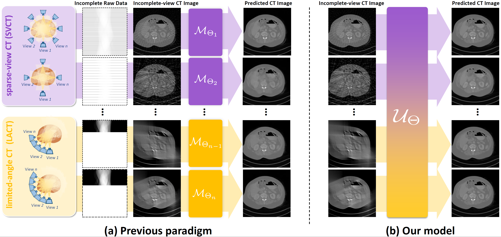

# Prompted Contextual Transformer for Incomplete-View CT Reconstruction
This repository contains the official implementation of the paper: "[Prompted Contextual Transformer for Incomplete-View CT Reconstruction](https://arxiv.org/abs/2312.07846)" (formerly, "Universal Incomplete-View CT Reconstruction with Prompted Contextual Transformer"), where we built a model that unifies the image-domain reconstruction of incomplete-view CT (including sparse-view CT and limited-angle CT) from a vast range of settings using a single set of parameters.




🚧We are currently cleaning and reformatting the code. Please stay tuned!🚧

## Abstract
> Incomplete-view computed tomography (CT) can shorten the data acquisition time and allow scanning of large objects, including sparse-view and limited-angle scenarios, each with various settings, such as different view numbers or angular ranges. However, the reconstructed images present severe, varying artifacts due to different missing projection data patterns. Existing methods tackle these scenarios/settings separately and individually, which are cumbersome and lack the flexibility to adapt to new settings. To enjoy the multi-setting synergy in a single model, we propose a novel Prompted Contextual Transformer (ProCT) for incomplete-view CT reconstruction. The novelties of ProCT lie in two folds. First, we devise a projection view-aware prompting to provide setting-discriminative information, enabling a single ProCT to handle diverse incomplete-view CT settings. Second, we propose artifact-aware contextual learning to sense artifact pattern knowledge from in-context image pairs, making ProCT capable of accurately removing the complex, unseen artifacts. Extensive experimental results on two publicly available clinical CT datasets demonstrate the superior performance of ProCT over state-of-the-art methods---including single-setting models---on a wide range of incomplete-view CT settings, strong transferability to unseen datasets and scenarios, and improved performance when sinogram data is available.


## Updates
- [ ] pretrained model.
- [ ] training/inference code.
- [x] architecture code.
- [x] 2023/12/13. Initial commit.


## Requirements
We built our model based on torch-radon toolbox that provides highly-efficient and differentiable
tomography transformations. 
```
- python==3.7.16
- torch==1.7.1+cu110  # depends on the CUDA version of your machine
- torchaudio==0.7.2
- torchvision==0.8.2+cu110
- torch-radon==1.0.0
- monai==1.0.1
- scipy==1.7.3
- einops==0.6.1
- opencv-python==4.7.0.72
- SimpleITK==2.2.1
- numpy==1.21.6
- pandas==1.3.5  # optional
- tensorboard==2.11.2  # optional
- wandb==0.15.2  # optional
- tqdm==4.65.0  # optional
```
If you're using higher version of CUDA, following the steps in `./inst_tr.sh` may be helpful for installation.

## Acknowledgement
- Torch Radon
- DehazeFormer
- UniverSeg
- GloReDi
- ...

## Citation
If you find our work and code helpful, please kindly cite our paper :)
```
@article{ma2023proct,
  title={Prompted Contextual Transformer for Incomplete-View CT Reconstruction},
  author={Ma, Chenglong, and Li, Zilong and He, Junjun and Zhang, Junping and Zhang, Yi and Shan, Hongming},
  journal={arXiv preprint arXiv:2312.07846},
  year={2023}
}
```
